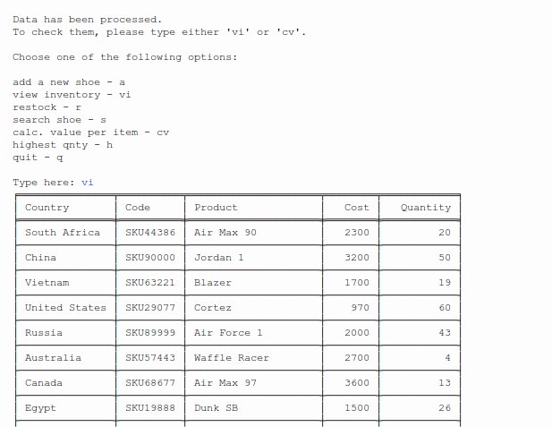
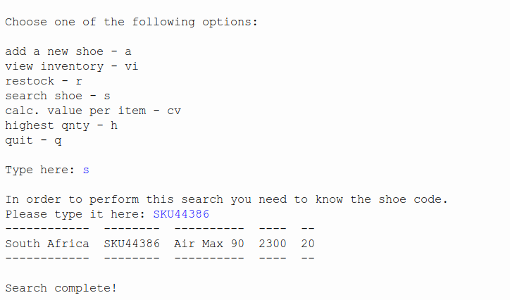
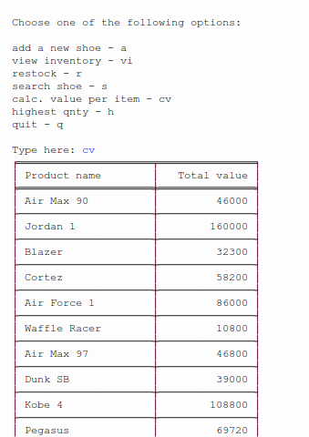

# finalCapstone

## Inventory manager program

### Quick overview

This program allows anyone in charge of a warehouse inventory to manage it in an efficient way. 
The program reads data from a text file ( *inventory.txt*).
It allows product search by code, determine the product with the lowest quantity 
and restock it, determine the product with the highest quantity, calculate the total
value of each stock item and add a new item to the inventory.
Data are displayed in a neatly formatted way, making it very easy to read through 
the inventory.

### Installation

To run the program you just need to downlaod [PYthon3](https://www.python.org/downloads/). 
An IDE to run Python code should be included by default (IDLE). 
If not I recommend [Visual Studio Codium](https://vscodium.com/).
At the moment no GUI is provided.

### Usage

Below are some screenshot of how the program works:

- **View Inventory option**

- **Search product by code**
 

- **Calculate total value of each stock**

